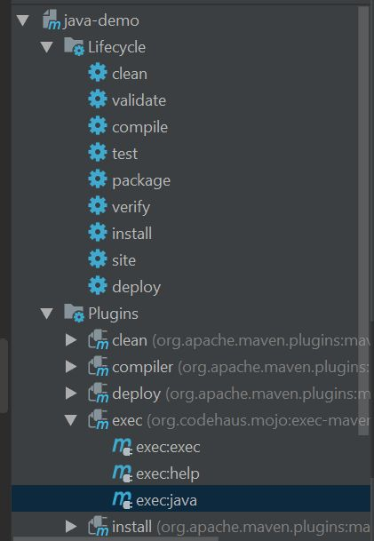

# Amazon Polly

This example requires Amazon account and IAM role allowing you to use Polly SDK.
Hopefully, I am going to deliver you one during our session.

1. First you need to do to make this example working is setting two environment variables in Windows system.
From the desktop, right click the My Computer icon.
Choose Properties from the context menu.
Click the Advanced tab (Advanced system settings link in Vista).
Click Environment Variables. ...
Set up:

* AWS_ACCESS_KEY_ID
* AWS_SECRET_ACCESS_KEY

2. Compile & run code using `compile` and `exec:java` Maven commands

3. In `PollyDemo.java` we prepared couple variables:
* VOICE_NAME - defines which voice Polly should use to synthesize given phrase 
Here is list of available voices in AWS Polly service https://docs.aws.amazon.com/polly/latest/dg/voicelist.html
* SAMPLE - phrase which is going to synthesized.
* BREATH_TAGS - we added additional tags which allows you to modify output. You can read more about it here: https://aws.amazon.com/blogs/machine-learning/amazon-polly-releases-new-ssml-breath-feature/

# Exercise

1. Modify, PollyDemo to work more like chat app.
2. This should work like following:
* Program asks user for name of voice which should be used. e.g.
  > Maja
* Now program asks, what Maja should tell you. E.g.
> Jestem Maja pszczółka Maja
* Now sound should be generated and played, and whole process should repeat, to let user choose new voice and sentence.
